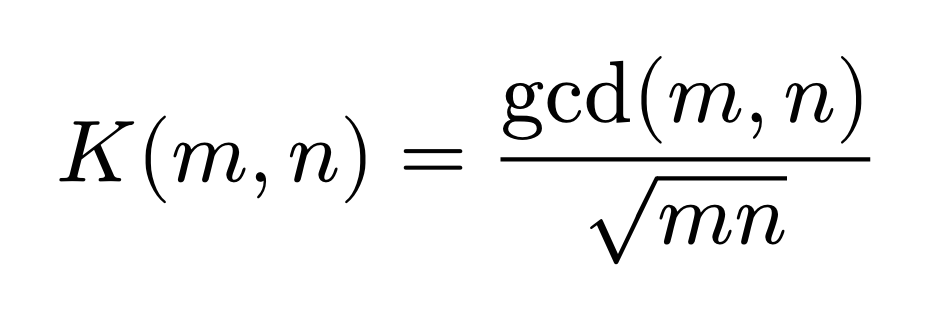
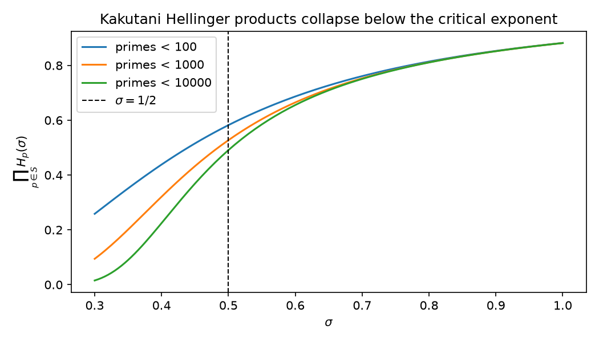
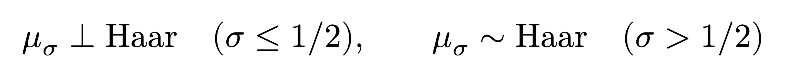
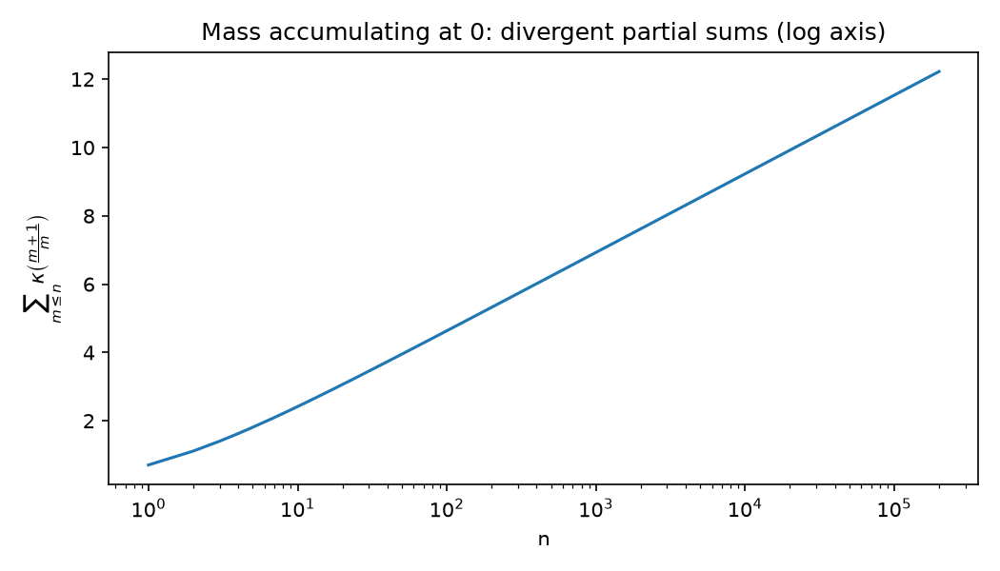
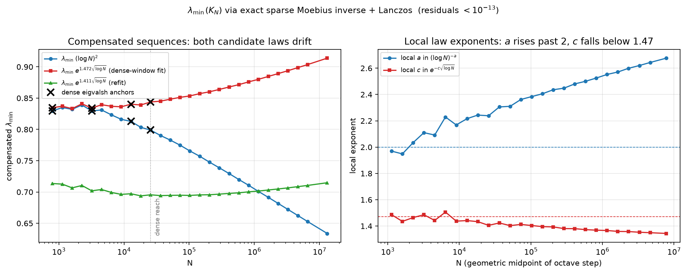
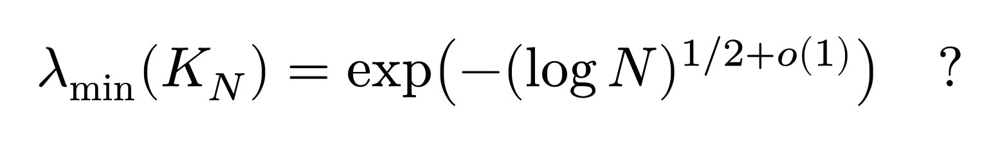
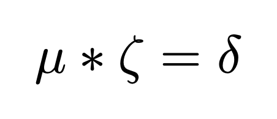
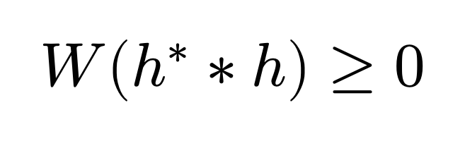

# The Absence Changes Venue

## A Chronicle of the Critical Line

*by Daniel Rodriguez*

The last chronicle ended at a wall. Somewhere past the reach of every computation, arithmetic keeps a boundary: the place where checking runs out, where only proof would do, and where proof has not come. I called it the firewall, and I left it standing, because there was nothing else to do with it.

This is the chronicle of what happened when I stopped pushing on the wall and started surveying the ground it stands on.

In 1859, Bernhard Riemann wrote that all the interesting zeros of a certain function probably lie on a single line. He admitted he could not prove it and set the search aside after, in his words, some fleeting futile attempts. The setting-aside was temporary, also in his words. The field has lived inside that word for a hundred and sixty-seven years.

## The complaint

The usual telling of the Riemann Hypothesis is about placement. There is a function, the zeta function; it has infinitely many zeros of a special kind; a line runs vertically through the number plane at real part one half; every zero ever computed sits exactly on the line; nobody can prove the next one will.

Stated that way, the problem sounds like cartography, and the failure sounds like a surveying deficit: we have not looked closely enough, or cleverly enough, at where the points sit.

The motion I eventually filed argues that the question is typed wrong. A zero slightly off the line would read, in the right coordinates, as an unstable mode in a system that arithmetic requires to be stable, the way a bridge requires its resonances damped. In those coordinates the Hypothesis stops being a claim about where points sit and becomes a claim about what kind of object the arithmetic is. Questions of kind are settled by finding the venue where the object lives natively. That is what this year was for.

## The kernel

Take two whole numbers. Divide their greatest common divisor by the square root of their product.

For 12 and 18 this gives 6 over the square root of 216, about 0.41. Do it for every pair of numbers up to N and you have a table: one number per pair, measuring how much multiplicative structure the pair shares. The table is old. H. J. S. Smith computed its determinant in 1876.

What matters is the denominator. The square root is a half-power, and one half is the exponent the Riemann Hypothesis is about. Nothing was imported to arrange this. The kernel does not visit the critical line; it lives there.

The table also has a hidden geometry. Send each number n to the set of its multiples, normalize, and the entries of the table become inner products: overlaps between divisibility sets, angles in a concrete geometric space. Divisibility becomes length. And in that geometry the table's positivity is not something you check row by row and hope; it is inherited from the construction, the way no squared length can be negative.

That sentence is the thesis of the whole program, so I will say it the way the motion says it: cancellation does not know its sign until it is represented as length.

## What proved means here

Before going further I owe you the meaning of a word, because this chronicle uses it differently than the last one did.

Everything below that I call proved has been checked by a proof assistant: a program, Lean, that accepts a proof only when every step follows from the axioms, and rejects it otherwise. A wrong proof does not compile. The repository holding this work runs that check on every change, forbids unfinished proofs mechanically, and publishes the audit trail down to the axioms used.

The instrument earned its keep on the first day. An automated survey of the project's initial scaffold reported everything proved. The build disagreed: two proofs had gaps the survey missed. Claims drift toward overclaim unless something mechanical pushes back. We built the record so that nothing in it can drift.

I say we. I built this in collaboration with two machine intelligences, Claude Fable 5 and GPT 5.5 Pro; the repository's readme records who did what. That arrangement sounds like it should raise a question of trust. It answers one instead: the kernel of the proof checker accepts or rejects the mathematics regardless of who wrote it, human or otherwise. You do not have to trust any of us. You can run the check.

## The freeze

Now the centerpiece.

Give every prime number its own circle. On each circle, place a probability distribution that leans toward angle zero, and control the lean with a single dial, the exponent σ: at large σ the lean is faint, at small σ it is heavy. Multiply the distributions together, one factor per prime, into a single object living on the infinite product of all the circles at once. This object is the spectral shadow of the divisibility table; its Fourier coefficients are exactly the table's entries. That identification is proved, all the way up to the infinite product.

Then move the dial and watch.

Above one half, the combined object remains compatible with the perfectly uniform one: the two can be exchanged, each absolutely continuous in the other, the way two mixable liquids share a container. At one half and below, they separate into mutually exclusive worlds, concentrated on disjoint sets, with no passage between them.

The change is abrupt, the way water at zero degrees is abrupt. A phase transition, at exactly the number Riemann wrote down, with the critical point itself on the frozen side.

The theorem governing this kind of transition belongs to Shizuo Kakutani, 1948. When we went to cite it in machine-checked form, there was no machine-checked form; in seventy-seven years, no proof assistant had held it. So the record now holds it: both directions, arbitrary index sets, checked to the axioms, and being prepared for the common mathematical library where anyone can use it. To my knowledge this is its first formalization anywhere. A claim like that needs a search behind it and will get another before print; it is hedged accordingly.

The consequence deserves its own line. The critical line of the Riemann zeta function appears in this venue as a phase boundary between measures, and that statement is now a theorem a machine has verified.

## The failure we kept

One bridge from the finite tables toward the Hypothesis is so tempting that the motion had to try it: push the finite spectral shadows directly to their infinite limit and hope the Weil functional, the object whose positivity is the Hypothesis, falls out. It does not. The mass piles up unboundedly near zero; the limit fails to be a measure at all.

The motion marked this route False as stated when it was written. The record now contains a machine-checked proof of the failure, held to the same standard as the successes. A docket that only verifies its wins is an advertisement. This one verifies its losses.

## The eigenvector that knew

Here is where the venue stopped answering my questions and started asking its own.

Every finite table has a weakest direction: the combination of numbers on which the geometry comes closest to collapsing, the eigenvector of the smallest eigenvalue. We computed it, for tables of size two thousand and beyond, and looked at it. The mass concentrates on smooth numbers, the ones built from small primes. And the signs of its entries follow the Liouville function, the fundamental plus-minus rhythm of cancellation in number theory, with agreement above 99.99 percent.

We represented cancellation as length and asked the geometry where it was weakest. It answered with the signs of cancellation. No one put them there.

The portrait suggested a witness, Möbius signs on the divisors of a primorial, and the witness became a bound on how small the weakest direction can be. On paper the bound has a full proof; in the machine it is a theorem; to my knowledge it is new. Small mathematics, but mathematics the venue produced by the complete route: observe, conjecture, derive, validate numerically to fifteen digits, verify in the kernel.

The true decay is stranger than the bound. The data, computed exactly out to tables of size thirteen million, reject every rate that constructions built prime-by-prime can achieve. Whatever the weakest direction is doing, it entangles the primes in a way no per-prime recipe reproduces.

That question is open, precisely posed, with instruments attached, and I would be glad to see it taken from me.

The computation itself closed a loop I did not plan. Reaching size thirteen million was possible because the divisibility table's inverse is, exactly, the Möbius matrix: the record's first theorem, Möbius inversion, turned out to be its fastest algorithm.

## The gate

The firewall from the last chronicle has not moved. But the survey gives it coordinates.

Everything above lives on the near side: the kernel, its geometry, its spectrum, the freeze at one half, the new theorem, the open question. On the far side sits the Riemann Hypothesis. And the wall between them, in this venue, is one inequality about one object, the completed Weil distribution paired against test functions:

By a theorem of André Weil from 1952, that inequality carries the full strength of the Hypothesis. Constructing the completed object and proving the inequality is the locked chamber, and the motion names it rather than picking it.

The record enforces the same manners. The inequality exists in the repository as a formal statement; the theorem connecting it to the Hypothesis is deliberately absent. When a sentence would be worth a million dollars, the honest move is to state it precisely and refuse to wink.

## The amendment

The last chronicle ended with an image I still stand behind: reality filling the gap that perfect absence refuses to occupy. I have an amendment to file.

The gap has a venue now. The ground in front of the wall has been surveyed, and the survey is not prose; it compiles. Some of what it recorded had waited seventy-seven years for a machine to hold it. Some of it did not exist a season ago and could not have been phrased in the old coordinates at all, because a question about the softest direction of divisibility-as-length only exists once divisibility is length.

The full motion, with its mathematics, its claim docket, and its complete machine-checked record, is filed in the open:

- The repository: https://github.com/idolum-ai/riemann-venue
- The motion, typeset with its exhibits: `essay/motion.pdf` in the repository

The critical line is where arithmetic should be recentered next.

The venue is open.

---

*This essay continues "Nothing Else Is So Exact As Absence: A Chronicle of Zeros." It was written in collaboration with Claude Fable 5 (Anthropic) and GPT 5.5 Pro (OpenAI); the repository records their roles, and the proofs do not require trusting any of us.*
